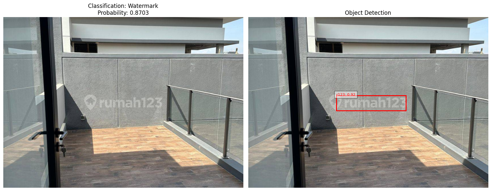

# Watermark Detection API

Watermark Detection is end-to-end solution to detect and localize watermarks in a set of images.
This project implements a watermark detection API using FastAPI and machine learning models.


## Local Development

1. Clone the repository:
   ```
   git clone https://github.com/DanielRiandy/Watermark_detection.git
   cd Watermark_detection
   ```

2. Install dependencies:
   ```
   pip install -r requirements.txt
   ```

3. Run the FastAPI server:
   ```
   uvicorn app:app --reload
   ```

## Deployment

### Docker

1. Build the Docker image:
   ```
   docker build -t your-dockerhub-username/watermark-detection:latest .
   ```

2. Run the container:
   ```
   docker run -p 8000:8000 your-dockerhub-username/watermark-detection:latest
   ```

### Kubernetes

1. Apply the Kubernetes configurations:
   ```
   kubectl apply -f deployment.yaml
   kubectl apply -f service.yaml
   ```

## CI/CD

This project uses GitHub Actions for CI/CD. On push to the main branch, it will:
1. Build and push the Docker image to DockerHub
2. Deploy the application to a Kubernetes cluster

Ensure you've set up the following secrets in your GitHub repository:
- DOCKERHUB_USERNAME
- DOCKERHUB_TOKEN
- KUBE_CONFIG

## API Usage

Send a POST request to `/detect_watermark/` with an image file to detect watermarks.

Example using curl:
```
curl -X POST "http://localhost:8000/detect_watermark/" -H "accept: application/json" -H "Content-Type: multipart/form-data" -F "file=@path_to_your_image.jpg"
```
